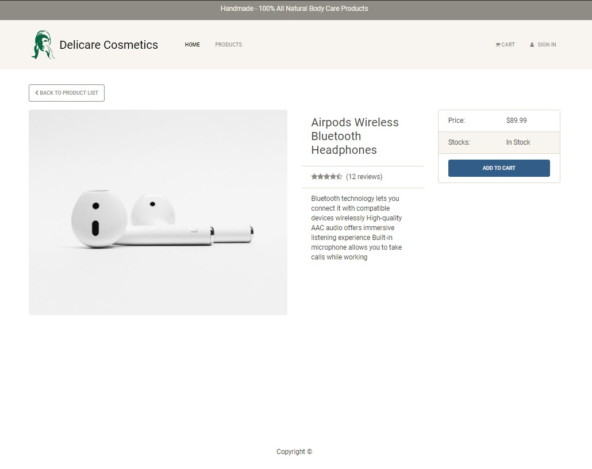

# Ecommerce site under construction using React JS libraries

## Table of contents

- [General info](#introduction)
- [Screnshots](#screenshots)
- [Features](#features)
- [Technologies](#technologies)
- [Setup](#setup)

## Introduction

Note: This application is still under development.

Ecommerce web application under development using ReactJS.

## Features

- Home Page with Prodcut Listing (Each part of the page is built as a react modules)
- Product rating display option using stars and review count
- Pure ReactJS Componants with hooks
- RESTful API
- Runnin on MonogoDB database
- ExpressJS server

## Technologies

- HTML / CSS
- ReactJS / JavaScript (ES6)
- MongoBD
- ExpressJS
- NodeJS

## Setup

1. install dependancies
2. npm run dev

## Screenshots

